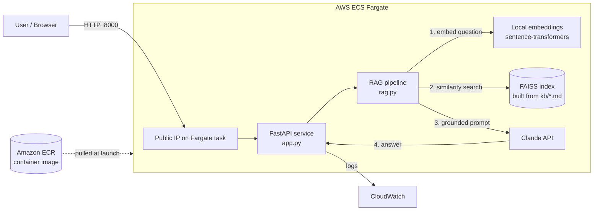

# RAG Support-Triage Assistant — on AWS ECS Fargate

A **Retrieval-Augmented Generation (RAG)** microservice that answers questions grounded in a
private knowledge base, packaged as a Docker container and deployed to **AWS ECS Fargate**.

Built to demonstrate depth across **both** sides of a modern AI system: the **AI/RAG pipeline**
(embeddings → vector search → grounded LLM generation) *and* the **cloud deployment**
(Docker → ECR → Fargate, with IAM, logging, and networking).

---

## Architecture



**Request flow:** browser → FastAPI (`/ask`) → embed the question locally → FAISS finds the most
relevant docs → those docs + the question go to Claude with "answer only from this context" →
grounded answer returned. Logs stream to CloudWatch.

---

## What it does

- **`/ask`** — answer a question using only the knowledge base (grounded, not hallucinated).
- **`/health`** — liveness probe (used by the load balancer / orchestrator).
- **`triage.py`** — a companion script that classifies a support ticket (summary, priority,
  category, action) using structured LLM output.

Knowledge base (`kb/`): a set of AWS topic notes — swap in any `.md` docs to re-target the domain.

## Tech stack

| Layer | Choice |
|---|---|
| API | FastAPI + Uvicorn |
| Retrieval | `sentence-transformers` (local embeddings) + FAISS |
| Generation | Claude (Haiku for classify, Sonnet for answers) |
| Container | Docker (CPU-only, multi-layer cached) |
| Cloud | AWS ECS Fargate, ECR, IAM, CloudWatch, VPC/Security Groups |

---

## Run locally

```bash
# 1. build
docker build -t triage-assistant .

# 2. run (pass your key at runtime — never bake it in)
docker run -p 8000:8000 -e ANTHROPIC_API_KEY=$ANTHROPIC_API_KEY triage-assistant

# 3. try it
#   http://localhost:8000/health   -> {"status":"ok"}
#   http://localhost:8000/docs     -> interactive UI for /ask
```

## Deploy to AWS (summary)

```bash
# push image
aws ecr create-repository --repository-name triage-assistant --region <REGION>
aws ecr get-login-password --region <REGION> | docker login --username AWS --password-stdin <ACCOUNT_ID>.dkr.ecr.<REGION>.amazonaws.com
docker tag triage-assistant:latest <ACCOUNT_ID>.dkr.ecr.<REGION>.amazonaws.com/triage-assistant:latest
docker push <ACCOUNT_ID>.dkr.ecr.<REGION>.amazonaws.com/triage-assistant:latest

# run on Fargate (see task-def.example.json)
aws ecs register-task-definition --cli-input-json file://task-def.json --region <REGION>
aws ecs run-task --cluster triage-cluster --launch-type FARGATE --task-definition triage-task \
  --network-configuration "awsvpcConfiguration={subnets=[<SUBNET>],securityGroups=[<SG>],assignPublicIp=ENABLED}" \
  --region <REGION>
```
> Copy `task-def.example.json` → `task-def.json` and fill in your values. The real `task-def.json`
> is `.gitignore`d because it holds the API key.

---

## Engineering decisions & trade-offs

*The reasoning behind the build — the part that matters more than the code.*

- **CPU-only image (≈7 GB → ≈600 MB).** The default `torch` wheel pulls the full CUDA/GPU stack.
  Fargate has no GPU, so I install the **CPU-only PyTorch wheel** before other deps. ~5× smaller
  image → faster ECR push, faster cold starts, lower storage cost.
- **Model choice per step.** `claude-haiku` for the high-volume *classify* step (cheap/fast),
  `claude-sonnet` for *answering* (higher quality). Matching model tier to task is a cost/quality lever.
- **Index built once at startup, not per request.** Importing `rag.py` builds the FAISS index when
  the service boots — slower cold start, fast queries. At scale you'd persist and load a pre-built index.
- **Relevance floor on retrieval.** Retrieved docs below a cosine-similarity threshold are dropped, so
  off-topic questions get "not enough context" instead of a confident hallucination.
- **Secrets at runtime, never in the image.** The API key is injected as an env var / (better) via
  AWS Secrets Manager — the image is a shareable artifact, so nothing secret is baked in.
- **HTTP for the demo.** Served over plain HTTP on a bare IP. Production would terminate **TLS** at an
  ALB/CloudFront with an ACM certificate on a real domain (HTTPS to the world, HTTP to the container).

## Possible next improvements
- API key → **AWS Secrets Manager**; **ALB + HTTPS**; **Terraform/CDK** for infrastructure-as-code.
- **Evals** (LLM-as-judge over a labelled question set) to measure answer quality.
- Swap FAISS for a managed vector DB (**pgvector on RDS** / **OpenSearch**); add reranking.
- **CI/CD** (GitHub Actions) to build + push on every commit.

## Repo layout
```
app.py                 FastAPI service (/ask, /health)
rag.py                 RAG pipeline (embed → FAISS search → grounded Claude call)
triage.py              structured-output ticket classifier
kb/                    knowledge-base docs (markdown)
Dockerfile             CPU-only container build
task-def.example.json  Fargate task definition template (copy → task-def.json)
requirements.txt
```
